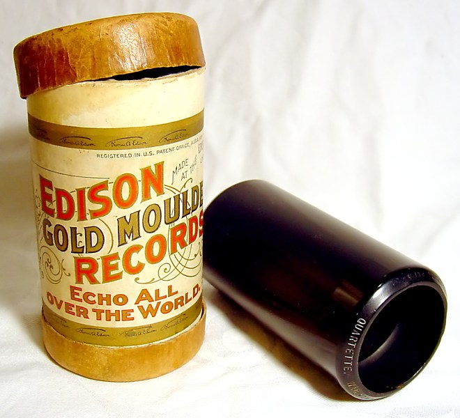
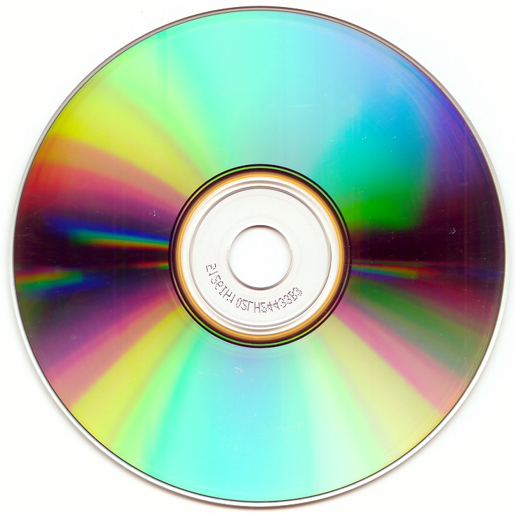

   

# MADT 307 Blog

## Blog 1 
Hello, My name is Sean Dillon. I am a senior at California State University, Chico, studying physics. I am set to graduate in May 2020 with my bachelors in Physics. I hope to be attending graduate school in the near future with a focus in astronomy and astrophysics. My current research interests include Galaxy Evolution, Observational Instrumentation, and Computational Modeling.

When I'm not working on homework and/or cussing out my code, you can often find me enjoying a nice hike outdoors. Otherwise, I'm playing Dungeons and Dragons with my roommates.

## Blog 2
For this blog, I like to think of the evolution of storing music. Music has always been a way of communication. However, capturing the sound of music is relatively recent. As time changes, so is the way we store music. We show here the evolution of music storage, and the progression from wax cylinders to spotify. 

#### Phonograph Cylinder (1896-1915) [source](https://en.wikipedia.org/wiki/Phonograph_cylinder)

#### Vinyl Record (1940s-present) [source](https://en.wikipedia.org/wiki/LP_record)

#### Compact Disk (1982-present) [source](https://simple.wikipedia.org/wiki/Compact_disc)

#### LimeWire (2000-2010) [source](https://www.google.com/url?sa=i&rct=j&q=&esrc=s&source=images&cd=&ved=2ahUKEwif6rbmqa7nAhVNHDQIHQyIBugQjRx6BAgBEAQ&url=https%3A%2F%2Fwww.digitaltrends.com%2Fcomputing%2Flimewire-creators-liable-for-copyright-infringement%2F&psig=AOvVaw3l8lIRp1t8xlQJaezmwVC3&ust=1580576863909825)

#### Spotify (2006-present) [source](https://www.spotify.com)

## Blog 3
Question: If all of your friends jumped off a bridge, would you jump too?

Machine Learning Algorithm: yes.

I am interested in looking into machine learning, or Artificial Intelligence for all the sci-fi geeks out there. When most people think of Artificial Intelligence, they almost always think back to Arnold Schwarzenegger in the hit movie Terminator. However, it is incredibly unlikely that AI, or machine-learning, will ever rise up against us. It is, however, an incredibly useful tool that allows for advancements ranging from science to the stock exchange. There are of course risks that machine learning could be abused, but it is unlikely to be spawning robots and destroying civilization. 

Modern machine learning is just extrapolating from previous data. It uses previous data as the sole source of what to do in the future. In order to use machine learning algorithms, computer scientists give the computer sample data that it can then use to make further predictions. And computers are really good at making further predictions. 

While I have never intentionally created or interacted with machine learning, I have been exposed to it in my research as a physicist. While coding for a research project, it was suggested to me that I use a python library called scikit-learn, which I found out later to be a library that focuses on machine learning. I only used a few functions from said library, but it was enough to spark my curiosity. (Over winter break, I was able to go to the American Astronomical Society meeting in Honolulu, where I was able to meet with some representatives from NUMfocus, a group that helps create almost all scientific libraries in python, including scikit-learn, numpy, scipy, astropy, matplotlib, etc.) 

For my kickstarter project, I want to learn more about machine learning and how to use it in my scientific research and to apply it to further research. For the project itself, well, there’s still a lot that will need to be done. But something with machine-learning would be cool. 

## Blog 5
[Blog 5](files/Blog 5.pdf)

