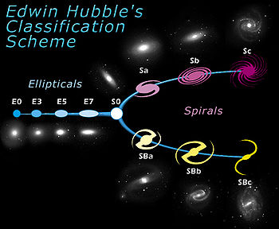

# A Brief Research History

####  [Home](README.md)   |   [CV](CV.md)   |   [Publications](publications.md)   |   [Contact](contact.md)  |  [Research](research.md)

_In the beginning the Universe was created. This has made a lot of people very angry and been widely regarded as a bad move._

-Douglas Adams

## Computational Astrophysics
When I was in high school, I had to interview an astrophysicist for my senior project. A bit of advice he gave me was to get really good at python programming. Fast forward to the present day, and I think I have a relatively decent amount of experience in computation (or, at the very least, in googling stuff until it works).

Computational Astrophysics is the study and usage of computers in the field of astrophysics. Computers are used for data processing, statistical analysis, modeling, observing, and learning (terrifyingly). I use [Python](https://www.python.org) for my research because it is relatively easy to use, simple, and understandable. I do have a laundry list of other languages that I'd like to start learning about, including Fortran, C++, and R. I will get around to learning these as the need arises. Using python, I have been able to model solar convection, use machine-learning algorithms, and make spectra of stars.

### Solar Convection Modeling
In the Fall 2018 semester, I started working with Dr. Nicholas Nelson at California State University--Chico on a project that had initially been started by a previous student of his. Dr. Nelson got me introduced to Rayleigh, a solar convection model code. Unfortunately, we didn't have the computational power to run these simulations, so it kinda sputtered out. I got a poster out of it though!

Solar convection is a very interesting topic. Do you know how when you add milk or cream to a cup of coffee or tea? The way the milk moves in the coffee is *similar* to how matter travels on the surface of the Sun. The Sun has an outer zone called the _convection zone_, which is where (as you might be able to tell) the majority of solar convection occurs. However, it gets a bit more complicated when you calculate in the rotation of the Sun (which spins faster at its equator than at its poles) and magnetic fields (which contribute to solar flares). 

### Galaxy Evolution
When I started an [REU program](https://www.nsf.gov/funding/pgm_summ.jsp?pims_id=5517) at [Haverford College](https://www.haverford.edu/), I had very little background in astronomy (I still don't, but its gotten better). As a result, this led me to some fascinating research in the field of galaxy evolution. My advisor, Dr. Karen Masters, works heavily with the Sloan Digital Sky Survey ([SDSS](https://www.sdss.org/)) subsurvey [MaNGA](https://www.sdss.org/surveys/manga/), which has data from ~10,000 nearby galaxies. 

Galaxies come in all shapes and sizes. Some are really big, some are only moderately big. Some are bright red and pink, others are more blue. Some are really old, some are new, and some are a mystery unto themselves. Originally, it was thought that the color and the shape of a galaxy could determine it's age. When it was realized that that was wrong, astronomers started looking at other measurable quantities could be used to determine the age. My work with galaxies (as well as my current work) revolved around the what these galaxies are made of, looking at spectra from galaxies and comparing them to other quantities, such as solar mass, metallicity (how much stuff is there that's heavier than helium), nearest neighbors, etc. 

__Insert Hubble Tuning Fork Diagram Here__

### Cosmic Dust 
Currently, I am working with Dr. Angela Speck on modeling cosmic dust around the star RX Boo (which my partner lovingly refers to as Dr. Booboo). We are using a modeling program DUSTY, which models dust around blackbodies. 

__Still a Work In Progress__

